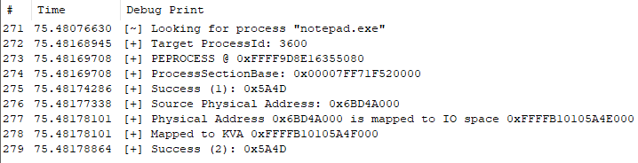

# ProcessVmAccess

Two PoC of accessing process virtual memory via NT Kernel

# Detail

You've never interested in accessing process virtual memory through NT-Kernel, without `MmCopyVirtualMemory`?

Read: https://www.godeye.club/2021/06/25/001-mmcopyvirtualmemory.html
Sorry its Japanese :(